# Readest - AI 对话式电子书阅读器

> 更新时间：2026-02-21 16:30:00

## 项目愿景

Readest 是一款开源电子书阅读器，专为沉浸式深度阅读体验而设计。作为 [Foliate](https://github.com/johnfactotum/foliate) 的现代重写版，它利用 Next.js 16 和 Tauri v2 构建，提供跨平台（macOS、Windows、Linux、Android、iOS、Web）的流畅阅读体验。

## 架构总览

```mermaid
graph TD
    A["Readest 电子书阅读器"] --> B["前端: Next.js 16"];
    A --> C["后端: Tauri v2 (Rust)"];
    A --> D["子模块 (Git Submodules)"];

    B --> B1["app/library - 书架管理"];
    B --> B2["app/reader - 阅读器核心"];
    B --> B3["app/opds - OPDS 订阅"];
    B --> B4["app/auth - 认证系统"];
    B --> B5["store/ - Zustand 状态"];
    B --> B6["services/ - 业务服务"];
    B --> B7["components/ - UI 组件"];
    B --> B8["libs/ - 核心库"];
    B --> B9["utils/ - 工具函数"];
    B --> B10["types/ - 类型定义"];

    C --> C1["src-tauri/plugins/ - 插件"];
    C --> C2["src-tauri/src/ - Rust 后端"];

    D --> D1["foliate-js - PDF/EPUB 渲染"];
    D --> D2["tauri - 框架"];
    D --> D3["tauri-plugins - 插件"];
    D --> D4["simplecc-wASM - 简繁转换"];
```



## 模块索引

| 模块 | 路径 | 职责 | 文档 |
|------|------|------|------|
| **书架** | `app/library/` | 图书管理、导入、分类 | ✅ |
| **书架组件** | `app/library/components/` | 书籍展示、分组、导入 | ✅ |
| **阅读器** | `app/reader/` | 核心阅读体验、标注 | ✅ |
| **阅读器 Hooks** | `app/reader/hooks/` | 阅读器业务逻辑 | ✅ |
| **OPDS** | `app/opds/` | OPDS 订阅、在线图书馆 | ✅ |
| **认证** | `app/auth/` | Supabase/Apple/Google 认证 | ✅ |
| **API** | `app/api/` | 后端 API 路由 | ✅ |
| **Store** | `store/` | Zustand 状态管理 (15个) | ✅ |
| **AI 服务** | `services/ai/` | AI 对话、RAG、嵌入 | ✅ |
| **TTS 服务** | `services/tts/` | 文本转语音 | ✅ |
| **翻译服务** | `services/translators/` | DeepL/Yandex/Google 翻译 | ✅ |
| **元数据服务** | `services/metadata/` | 图书元数据搜索 | ✅ |
| **同步服务** | `services/sync/` | KOReader/Cloud Sync | ✅ |
| **文本转换器** | `services/transformers/` | 简繁/标点/校对转换 | ✅ |
| **Components** | `components/` | UI 组件库 (70+个) | ✅ |
| **Libs** | `libs/` | 核心业务库 | ✅ |
| **Utils** | `utils/` | 工具函数库 | ✅ |
| **Types** | `types/` | TypeScript 类型定义 | ✅ |
| **Tauri 插件** | `src-tauri/plugins/` | 原生功能插件 | ✅ |
| **Rust 后端** | `src-tauri/src/` | Rust 后端核心 | ✅ |

    click B1 "./apps/readest-app/src/app/library/CLAUDE.md" "查看书架模块"
    click B2 "./apps/readest-app/src/app/reader/CLAUDE.md" "查看阅读器模块"
    click B3 "./apps/readest-app/src/app/opds/CLAUDE.md" "查看 OPDS 模块"
    click B4 "./apps/readest-app/src/app/auth/CLAUDE.md" "查看认证模块"
    click C1 "./apps/readest-app/src-tauri/plugins/CLAUDE.md" "查看 Tauri 插件"
```

## 技术栈

### 前端
- **框架**: Next.js 16 (App Router)
- **语言**: TypeScript
- **UI**: React 19 + Tailwind CSS + Radix UI
- **状态管理**: Zustand
- **AI 集成**: Vercel AI SDK + Ollama

### 后端
- **框架**: Tauri v2
- **语言**: Rust
- **插件**: tauri-plugin-fs, tauri-plugin-dialog, tauri-plugin-http, tauri-plugin-native-bridge, tauri-plugin-native-tts 等

### 渲染引擎
- **Ebook**: foliate-js (自定义 EPUB/MOBI/PDF 渲染)
- **PDF**: PDF.js

## 模块索引

| 模块 | 路径 | 职责 | 入口文件 |
|------|------|------|----------|
| **书架** | `apps/readest-app/src/app/library/` | 图书管理、导入、分类 | `page.tsx` |
| **阅读器** | `apps/readest-app/src/app/reader/` | 核心阅读体验、标注 | `page.tsx` |
| **OPDS** | `apps/readest-app/src/app/opds/` | OPDS 订阅、在线图书馆 | `page.tsx` |
| **认证** | `apps/readest-app/src/app/auth/` | Supabase/Apple/Google 认证 | `page.tsx` |
| **Tauri 后端** | `apps/readest-app/src-tauri/` | 原生功能、系统集成 | `lib.rs` |
| **状态管理** | `apps/readest-app/src/store/` | Zustand 状态存储 | `*.ts` |
| **AI 服务** | `apps/readest-app/src/services/ai/` | AI 对话、RAG、嵌入 | `index.ts` |
| **TTS 服务** | `apps/readest-app/src/services/tts/` | 文本转语音 | `TTSController.ts` |
| **翻译服务** | `apps/readest-app/src/services/translators/` | DeepL/Yandex/Google 翻译 | `index.ts` |
| **原生桥接** | `src-tauri/plugins/tauri-plugin-native-bridge/` | Android/iOS 原生 API | `lib.rs` |
| **原生 TTS** | `src-tauri/plugins/tauri-plugin-native-tts/` | 平台原生 TTS | `lib.rs` |

## 运行与开发

### 环境要求
- Node.js 22+
- pnpm 10+
- Rust 1.77.2+

### 初始化
```bash
git clone https://github.com/readest/readest.git
cd readest
git submodule update --init --recursive
pnpm install
pnpm --filter @readest/readest-app setup-vendors
```

### 开发命令
```bash
# Tauri 应用开发
pnpm tauri dev

# Web 应用开发
pnpm dev-web

# 生产构建
pnpm tauri build
```

### 测试
```bash
pnpm --filter @readest/readest-app test
```

## 测试策略

- **Vitest**: 单元测试
- **测试目录**: `apps/readest-app/src/__tests__/`
- **覆盖模块**: AI 服务、组件、工具函数、API 路由

## 编码规范

- **格式化**: Prettier
- **检查**: ESLint + TypeScript
- **Rust**: Cargo clippy
- **提交**: Husky 钩子

## AI 使用指引

### 主要 AI 功能
1. **对话式笔记本**: AI 辅助阅读笔记
2. **智能翻译**: 实时翻译选中文本
3. **RAG 知识库**: 基于书籍内容的问答
4. **嵌入生成**: 书籍语义搜索

### AI 提供商
- Ollama (本地)
- OpenAI
- Anthropic
- Azure OpenAI

## 变更记录

### 2026-02-21 - AI 上下文初始化
- 完成全仓文件扫描
- 生成模块结构图
- 创建根级 CLAUDE.md
- 识别 4 个主要子模块 + 10+ 功能模块

---

*更多信息请访问 [Readest 官网](https://readest.com) 或 [GitHub](https://github.com/readest/readest)*
